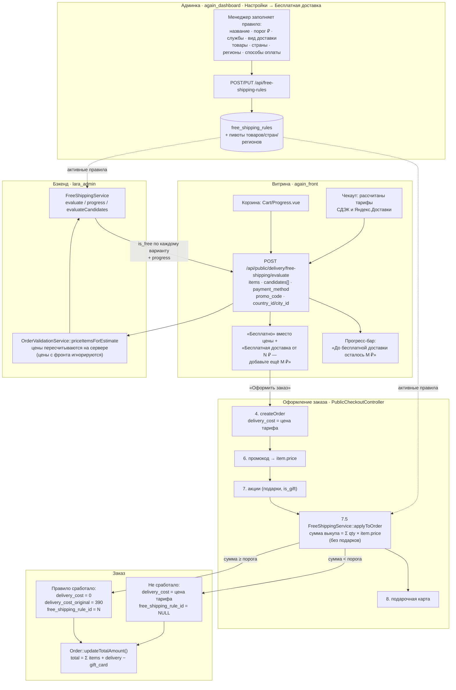
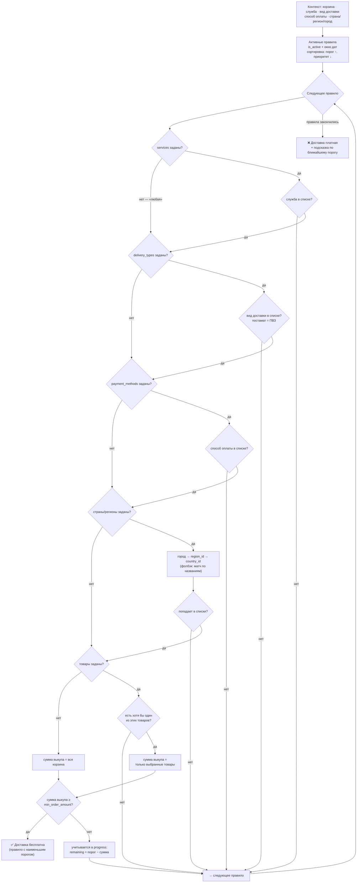
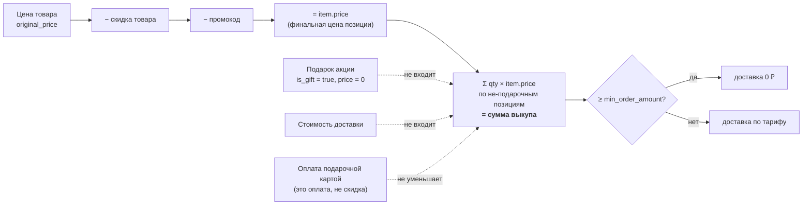
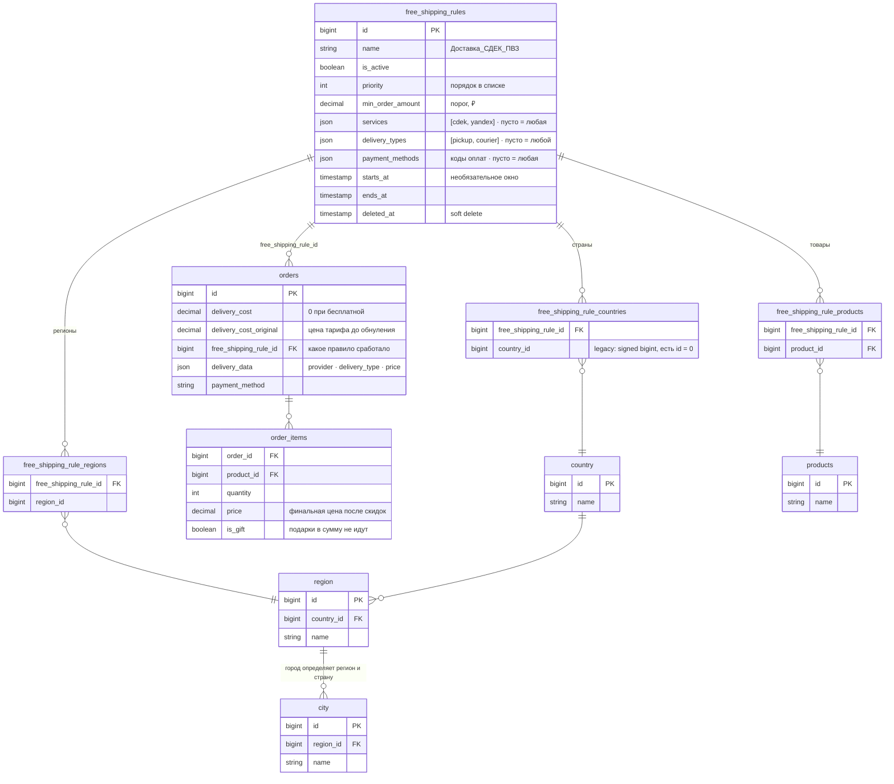
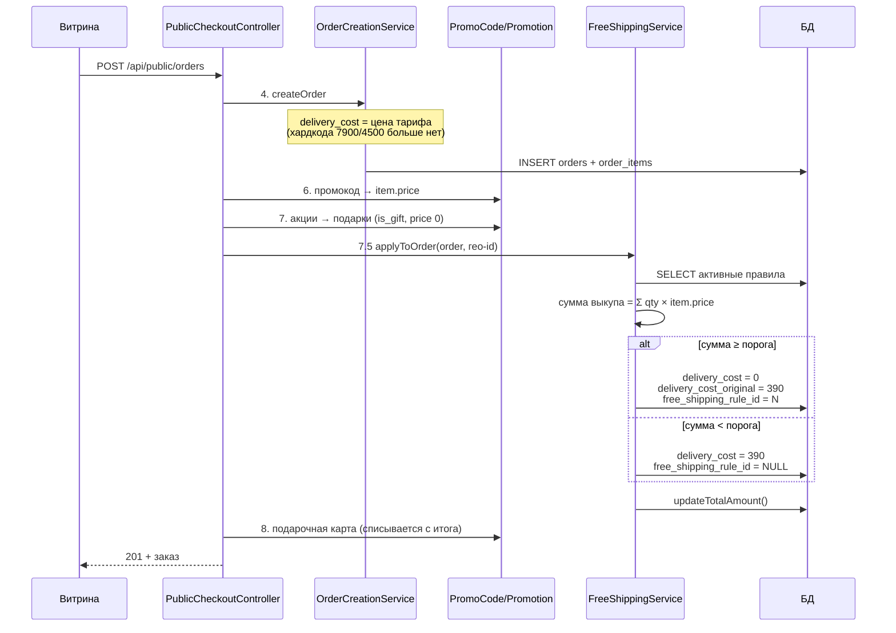
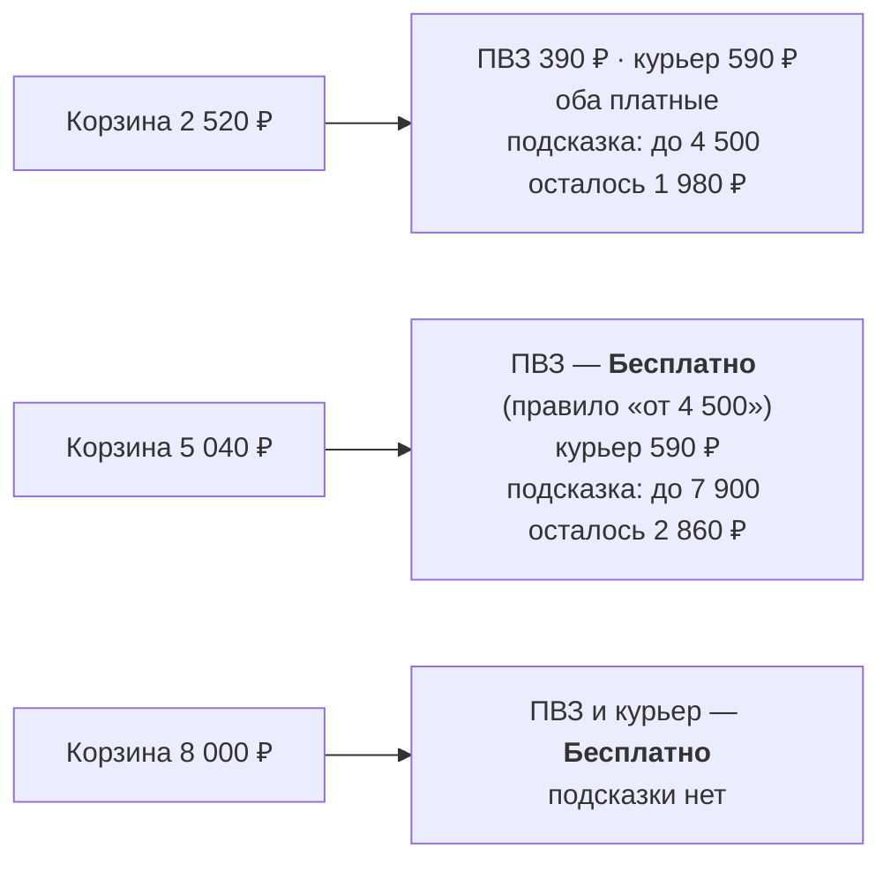

# Бесплатная доставка — архитектура (визуально)

Дополнение к [`free-shipping.md`](./free-shipping.md). Диаграммы Mermaid:
поток данных (runtime), схема БД (ER), алгоритм матчинга и порядок расчёта
в чекауте. Открывается в любом просмотрщике Markdown с поддержкой Mermaid
(GitHub, GitLab, IDE-плагины).

---

## 1. Поток данных: от правила в админке до бесплатной доставки в заказе

Ключевое: витрина **показывает**, сервер **решает**. Цена доставки в заказе
считается только в шаге 7.5 — после промокода и акций, поэтому скидки, уронившие
сумму выкупа ниже порога, автоматически возвращают платную доставку.

---

## 2. Алгоритм матчинга правила

Два режима проверки:

| Режим | Где | Неизвестное значение в контексте (NULL) |
|---|---|---|
| строгий | `evaluate()` — решение о бесплатности | условие **не** выполнено |
| щадящий | `progress()` — подсказка «осталось N ₽» | условие пропускается (покупатель ещё выберет) |

Поэтому в корзине, где доставка и оплата ещё не выбраны, прогресс-бар всё равно
показывает ближайший порог.

---

## 3. Сумма выкупа: что входит, что нет

> Акции в проекте дают **подарок**, а не денежную скидку. «Скидка вместо
> подарка» = отказ от подарка в пользу промокода/обычных скидок. Требование
> «с акцией сумма ниже 5000 → доставка платная» выполняется так: подарок в сумму
> не идёт, а промокод и скидки её уменьшают.

---

## 4. Схема БД

---

## 5. Порядок расчёта в чекауте (почему именно 7.5)

Если считать бесплатность на шаге 4, промокод и акции ещё не применены — сумма
была бы завышена. Поэтому расчёт идёт после них, а `applyToOrder` идемпотентен:
исходная цена тарифа хранится в `delivery_cost_original`, повторный вызов её не
теряет и умеет вернуть платную доставку.

---

## 6. Пример: два тарифных «этажа» (данные сидера)

Проверено на dev `againdev3.ru` — см. журнал в
[`free-shipping.md`](./free-shipping.md#14-журнал).
