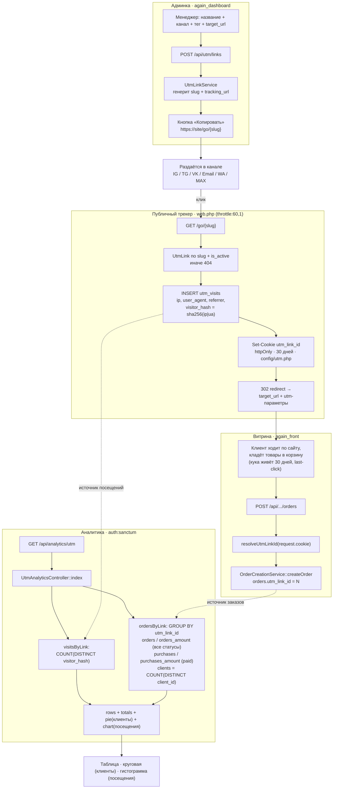
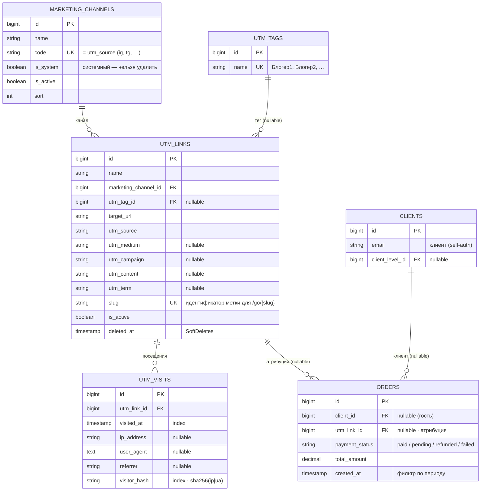

# UTM-трекинг — архитектура (визуально)

Дополнение к [`utm-tracking.md`](./utm-tracking.md). Диаграммы Mermaid:
поток данных (runtime) и схема БД (ER). Открывается в любом просмотрщике
Markdown с поддержкой Mermaid (GitHub, GitLab, IDE-плагины).

---

## 1. Поток данных (от создания метки до аналитики)



### Метрики и формулы (как в контроллере)

| Метрика | Источник / формула |
|---------|--------------------|
| Посещения | `utm_visits`, `COUNT(DISTINCT visitor_hash)` за период |
| Заказы | `orders` по `utm_link_id`, все статусы оплаты (refunded входит) |
| Оборот (заказы) | `SUM(total_amount)` всех заказов по метке |
| Покупки | заказы с `payment_status = paid` (refunded НЕ входит) |
| Сумма покупок | `SUM(total_amount)` где `payment_status = paid` |
| Клиенты (для круговой) | `COUNT(DISTINCT client_id)` |
| Конв. в заказ | `заказы / посещения × 100` (деление на 0 → 0) |
| Конв. в покупку | `покупки / заказы × 100` (деление на 0 → 0) |

---

## 2. Схема БД (ER)



---

## 3. Демо-данные

Сидер `Database\Seeders\UtmDemoSeeder` наполняет все таблицы вариантами данных
(в т.ч. граничные случаи). Запуск:

```bash
php artisan db:seed --class=UtmDemoSeeder
```

После сидинга открыть в дашборде: **Аналитика → Источники заказов**
(`/analytics/order-sources`).

> Даты привязаны к `now()`: большая часть данных попадает в окно «последние
> 30 дней» (период по умолчанию), часть — на 60–90 дней назад, чтобы проверить
> фильтр по периоду и месячную гранулярность графика (пресет «Всё время»).
